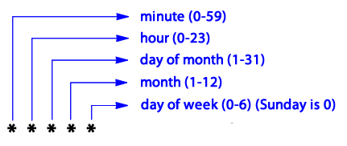

# Docker Scrapy Mailer

It's a simple [Docker](https://www.docker.com) container that uses [Scrapy](https://scrapy.org) library to grab and parse a website, generating parsable JSON file.

After that we bind the JSON with a [Mako](http://www.makotemplates.org) template, resulting in a dynamic mail content.

Finally, we send it according to the **MAIL_TO** informed environment variable.

## Pre Requirements

1. Docker

## How to Run

Build

```
docker build -t docker-scrapy-mailer:latest .
```

Run

```
docker run -e MAIL_FROM="from@mail" \
-e MAIL_FROM_PASSWORD="***" \
-e MAIL_TO="to1@mail,to2@mail,to3@mail" \
-e MAIL_SUBJECT="Mail Subject" \
-e MAIL_TEXT="Mail Text Body" \
-e MAIL_SMTP_HOST="smtp.mail" \
-e MAIL_SMTP_PORT="587" \
-e CRON_SCHEDULE="*/1 * * * *" \
-ti docker-scrapy-mailer
```


To make your **CRON_SCHEDULE** exception easily use the serive [CronTab Generator](https://crontab-generator.org)

Like




## References

* [Docker](https://www.docker.com)

* [CronTab Generator](https://crontab-generator.org)

* [Scrapy](https://scrapy.org)

* [Mako](http://www.makotemplates.org)